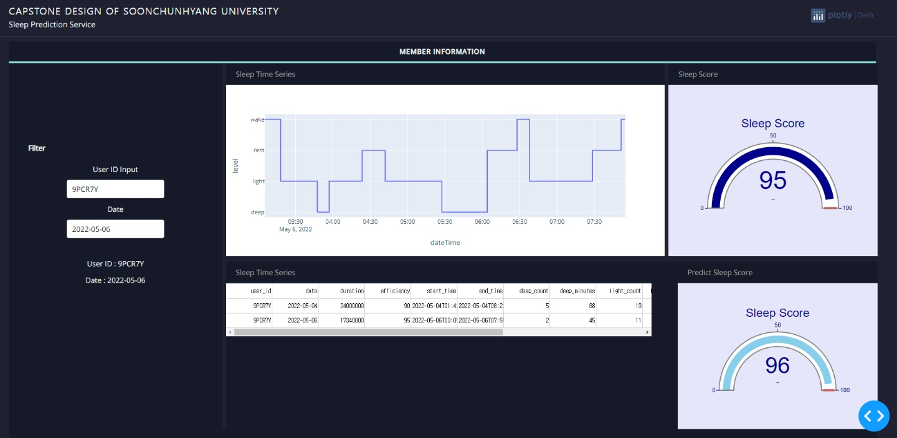

# Capstone_Design

빅데이터 공학과 캡스톤 디자인 프로젝트 입니다.

담당 교수님 : 우지영 교수님

### 주제
Fitbit API의 수면데이터를 이용하여 고객의 미래의 수면 패턴을 예측하는 대쉬 보드


### 사용 기술

- 언어 : [Python](https://www.python.org/) > 프로그래밍 언어


- APP : [Ploty](https://plotly.com/dash/) > 브라우저 기반 대시보드 프레임 워크


- ML : [scikit-learn](https://scikit-learn.org/stable/) > 머신러닝 모델 라이브러리


### UI
메인 UI 화면
<div align="center">
  <br>
</div>


### Folder Path
폴더 구조(경로)
```

│  README.md
│
│
├─api
│  │  api_request.py  # API 호출
│  │  main.py  # API 호출 실행
│  │
│  └─data  # 데이터
│      │
│      └─json
│              9PCR7Y_sleep_data_2022-03-12_2022-05-23.json
│              9PCR7Y_sleep_data_2022-05-24_2022-05-30.json
│              9WF9BJ_sleep_data_2022-03-12_2022-05-23.json
│              9WF9BJ_sleep_data_2022-05-24_2022-05-30.json
│              9WFFRS_sleep_data_2022-03-12_2022-05-23.json
│              9WFFRS_sleep_data_2022-05-24_2022-05-30.json
│              9WFNF8_sleep_data_2022-03-12_2022-05-23.json
│              9WFNF8_sleep_data_2022-05-24_2022-05-30.json
│
└─app  # APP 폴더
    │  main.py  # APP 실행
    │  ui.drawio  # UI 설계
    │
    ├─assets  # APP 디자인 파일
    │      base-styles.css
    │      dash-logo-new.png
    │      fonts.css
    │      plotly_logo.png
    │      spc-custom-styles.css
    │
    ├─catboost_info  # ML model
    │  │  catboost_training.json
    │  │  learn_error.tsv
    │  │  time_left.tsv
    │  │
    │  ├─learn
    │  │      events.out.tfevents
    │  │
    │  └─tmp
    │          cat_feature_index.cffa7d1a-c147790f-dcadf00e-6e247a70.tmp
    │
    ├─db  # DB read
    │      read.py
    │
    ├─key  # Key Folder
    │
    ├─test  # Test Code
    │  ├─db
    │  │      read.py
    │  │
    │  └─visualization
    │      │  data_table.py
    │      │  ml.py
    │      │  sleep.py
    │      │
    │      └─catboost_info
    │          │  catboost_training.json
    │          │  learn_error.tsv
    │          │  time_left.tsv
    │          │
    │          └─learn
    │                  events.out.tfevents
    │
    └─visualization  # 시각화 함수
            data_table.py  # 데이터 프레임
            ml.py  # ML 
            sleep.py  # sleep Plot
```
